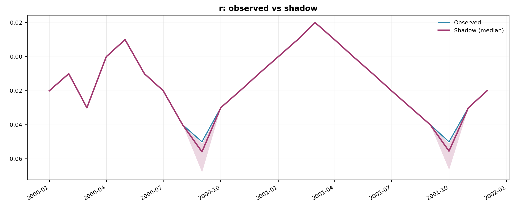
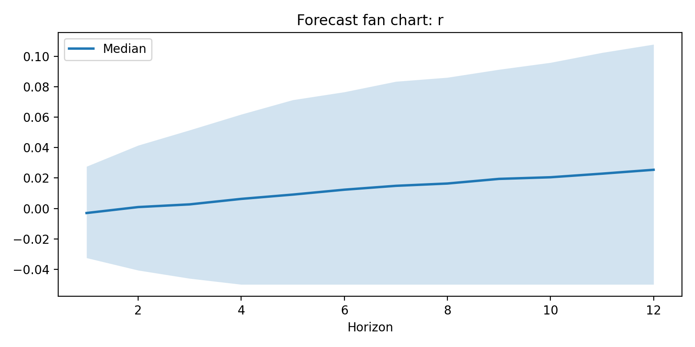

<!-- Improved compatibility of back to top link -->
<a id="readme-top"></a>

<!-- PROJECT SHIELDS -->
[![License][license-shield]][license-url]
[![Python][python-shield]][python-url]
[![Code style: black][black-shield]][black-url]
[![Ruff][ruff-shield]][ruff-url]

<!-- PROJECT LOGO -->
<br />
<div align="center">

<h1 align="center">srvar-toolkit</h1>

  <p align="center">
    Shadow-rate VAR toolkit for Bayesian macroeconomic forecasting in pure Python.
    <br />
    <a href="https://srvar-toolkit.charlesshaw.net/"><strong>Explore the docs »</strong></a>
    <br />
    <br />
    <a href="#usage">Quick Start</a>
    ·
    <a href="https://github.com/shawcharles/srvar-toolkit/issues/new?labels=bug">Report Bug</a>
    ·
    <a href="https://github.com/shawcharles/srvar-toolkit/issues/new?labels=enhancement">Request Feature</a>
  </p>
</div>

<!-- TABLE OF CONTENTS -->
<details>
  <summary>Table of Contents</summary>
  <ol>
    <li><a href="#about-the-project">About The Project</a></li>
    <li><a href="#features">Features</a></li>
    <li><a href="#getting-started">Getting Started</a></li>
    <li><a href="#usage">Usage</a></li>
    <li><a href="#roadmap">Roadmap</a></li>
    <li><a href="#contributing">Contributing</a></li>
    <li><a href="#license">License</a></li>
    <li><a href="#contact">Contact</a></li>
    <li><a href="#citing">Citing</a></li>
    <li><a href="#acknowledgments">Acknowledgments</a></li>
  </ol>
</details>

---

<!-- ABOUT THE PROJECT -->
## About The Project

<br />

**srvar-toolkit** is a lightweight, testable implementation of Shadow-Rate Vector Autoregression (SRVAR) models for macroeconomic forecasting. It provides a complete Bayesian workflow for fitting VARs with:

- **Effective Lower Bound (ELB) constraints** — Model interest rates that are censored at the zero lower bound
- **Stochastic volatility** — Capture time-varying uncertainty in economic variables
- **Minnesota-style shrinkage** — Improve forecast accuracy with informative priors
- **Variable selection (SSVS)** — Identify which predictors matter most

The toolkit is designed for researchers and practitioners who need transparent, reproducible Bayesian VAR estimation without the overhead of large econometric frameworks.

<p align="right">(<a href="#readme-top">back to top</a>)</p>

### Built With

[![Python][python-badge]][python-url]
[![NumPy][numpy-badge]][numpy-url]
[![SciPy][scipy-badge]][scipy-url]
[![Pandas][pandas-badge]][pandas-url]

---

<table>
  <tr>
    <td align="center" width="50%">
      
    </td>
    <td align="center" width="50%">
      
    </td>
  </tr>
</table>


---

<!-- FEATURES -->
## Features

| Component | Description | How to Enable | Status |
|-----------|-------------|---------------|--------|
| **Conjugate BVAR (NIW)** | Closed-form posterior updates and fast sampling for VAR coefficients/covariance | `PriorSpec.niw_default(...)` | ✅ Supported |
| **Minnesota Shrinkage** | Minnesota-style shrinkage via NIW prior construction | `PriorSpec.niw_minnesota(...)` | ✅ Supported |
| **Variable Selection (SSVS)** | Spike-and-slab inclusion indicators for stochastic search | `PriorSpec.from_ssvs(...)` | ✅ Supported |
| **Bayesian LASSO (BLASSO)** | Bayesian LASSO shrinkage prior for VAR coefficients (global or adaptive) | `PriorSpec.from_blasso(...)` | ✅ Supported |
| **Shadow-Rate / ELB** | Latent shadow-rate sampling at the effective lower bound | `ModelSpec(elb=ElbSpec(...))` | ✅ Supported |
| **Stochastic Volatility** | Diagonal log-volatility random-walk (KSC mixture sampling) | `ModelSpec(volatility=VolatilitySpec(...))` | ✅ Supported |
| **Combined ELB + SV** | Joint shadow-rate and stochastic volatility model | `ModelSpec(elb=..., volatility=...)` | ✅ Supported |
| **Forecasting** | Posterior predictive simulation with quantiles | `srvar.api.forecast(...)` | ✅ Supported |
| **Plotting** | Shadow rate, volatility, and fan chart visualisations | `srvar.plotting` | ✅ Supported |

<p align="right">(<a href="#readme-top">back to top</a>)</p>

---

## Glossary (acronyms)

- **ELB**: effective lower bound (censoring constraint applied to selected observed series)
- **NIW**: Normal-Inverse-Wishart prior (conjugate Bayesian VAR)
- **SSVS**: stochastic search variable selection (spike-and-slab variable selection)
- **SVRW**: stochastic volatility random walk (diagonal log-variance random-walk model)
- **KSC**: Kim-Shephard-Chib mixture approximation for log-\(\chi^2\)

---

<!-- GETTING STARTED -->
## Getting Started

### Prerequisites

- Python 3.11 or higher
- pip package manager

### Installation

#### Option 1: Editable Install (recommended for development)

```bash
git clone https://github.com/shawcharles/srvar-toolkit.git
cd srvar-toolkit
pip install -e .
```

#### Option 2: Install with Extras

```bash
# With plotting support
pip install -e '.[plot]'

# With FRED data fetching
pip install -e '.[fred]'

# With all development tools
pip install -e '.[dev]'

# All extras
pip install -e '.[dev,plot,fred,docs]'
```

<p align="right">(<a href="#readme-top">back to top</a>)</p>

---

<!-- USAGE -->
## Usage

### Quick Start

Fit a simple Bayesian VAR and generate forecasts:

```python
import numpy as np
from srvar import Dataset
from srvar.api import fit, forecast
from srvar.spec import ModelSpec, PriorSpec, SamplerConfig

# Create a dataset
ds = Dataset.from_arrays(
    values=np.random.standard_normal((80, 2)),
    variables=["y1", "y2"]
)

# Configure the model
model = ModelSpec(p=2, include_intercept=True)
prior = PriorSpec.niw_default(k=1 + ds.N * model.p, n=ds.N)
sampler = SamplerConfig(draws=500, burn_in=100, thin=1)

# Fit and forecast
fit_res = fit(ds, model, prior, sampler)
fc = forecast(fit_res, horizons=[1, 4], draws=200)
print(fc.mean)
```

### Shadow-Rate Model with Stochastic Volatility

```python
from srvar import Dataset, ElbSpec, VolatilitySpec
from srvar.api import fit, forecast
from srvar.spec import ModelSpec, PriorSpec, SamplerConfig

# Configure ELB + SV model
model = ModelSpec(
    p=4,
    include_intercept=True,
    elb=ElbSpec(applies_to=["interest_rate"], bound=0.125),
    volatility=VolatilitySpec(enabled=True)
)

# Fit with Minnesota prior
prior = PriorSpec.niw_minnesota(p=4, y=data_array, n=n_vars)
sampler = SamplerConfig(draws=2000, burn_in=500, thin=2)

fit_res = fit(dataset, model, prior, sampler)
```

### Plotting

```python
from srvar.plotting import plot_shadow_rate, plot_forecast_fanchart, plot_volatility

# Plot inferred shadow rate
fig, _ax = plot_shadow_rate(fit_res, var="interest_rate")
fig.savefig("shadow_rate.png", dpi=150, bbox_inches="tight")

# Plot forecast fan chart
fig, _ax = plot_forecast_fanchart(fc, var="gdp_growth")
fig.savefig("forecast.png", dpi=150, bbox_inches="tight")

# Plot volatility paths
fig, _ax = plot_volatility(fit_res, var="gdp_growth")
fig.savefig("volatility.png", dpi=150, bbox_inches="tight")
```

_For more examples, see the [`examples/README.md`](examples/README.md)._

### CLI + YAML (config-driven runs)

For production-style usage, you can run the toolkit from a YAML configuration file.

```bash
# Validate a config (checks schema, variable names, and basic compatibility)
srvar validate config/demo_config.yaml

# Run fit (+ optional forecast/plots depending on the config)
srvar run config/demo_config.yaml

# Override output directory
srvar run config/demo_config.yaml --out outputs/my_run
```

See:

- `config/demo_config.yaml` (comment-rich template)
- `config/minimal_config.yaml` (minimal runnable)

<p align="right">(<a href="#readme-top">back to top</a>)</p>

---

<!-- ROADMAP -->
## Roadmap

- [x] Conjugate BVAR (NIW) with closed-form posteriors
- [x] Minnesota-style shrinkage priors
- [x] Stochastic Search Variable Selection (SSVS)
- [x] Shadow-rate / ELB data augmentation
- [x] Diagonal stochastic volatility (SVRW)
- [x] Combined ELB + SV model
- [x] Forecasting with fan charts
- [x] Plotting utilities
- [x] Bayesian LASSO prior
- [ ] Steady-state VAR parameterisation
- [ ] Dirichlet-Laplace prior
- [ ] Full-covariance stochastic volatility
- [ ] Replication: Carriero et al. (2025) "Forecasting with shadow rate VARs" baseline results

See the [open issues](https://github.com/shawcharles/srvar-toolkit/issues) for a full list of proposed features.

<p align="right">(<a href="#readme-top">back to top</a>)</p>

---

<!-- CONTRIBUTING -->
## Contributing

Contributions are welcome and appreciated. To contribute:

1. Fork the repository
2. Create a feature branch (`git checkout -b feature/amazing-feature`)
3. Make your changes and add tests
4. Run the test suite (`pytest`)
5. Commit your changes (`git commit -m 'feat: add amazing feature'`)
6. Push to the branch (`git push origin feature/amazing-feature`)
7. Open a Pull Request

For full contributor guidelines (including docs builds, style, and testing expectations), see `CONTRIBUTING.md`.

### Limitations and performance notes

- This is currently an **alpha** research toolkit.
- SV is **diagonal** (no time-varying covariances).
- MCMC runtime depends heavily on ``T``, ``N``, and sampler settings (draws/burn-in/thinning).

The documentation site contains more detailed guidance and caveats.

### Development Setup

```bash
# Clone and install with dev dependencies
git clone https://github.com/shawcharles/srvar-toolkit.git
cd srvar-toolkit
pip install -e '.[dev]'

# Install pre-commit hooks
pre-commit install

# Run tests
pytest

# Run linting
ruff check srvar/
black --check srvar/
```

<p align="right">(<a href="#readme-top">back to top</a>)</p>

---

<!-- LICENSE -->
## License

Distributed under the MIT License. See `LICENSE` for more information.

<p align="right">(<a href="#readme-top">back to top</a>)</p>

---

<!-- CONTACT -->
## Contact

**Charles Shaw** — charles@charlesshaw.net

Project Link: [https://github.com/shawcharles/srvar-toolkit](https://github.com/shawcharles/srvar-toolkit)

<p align="right">(<a href="#readme-top">back to top</a>)</p>

---

<!-- CITING -->
## Citing

If you use **srvar-toolkit** in your research, please cite both the software and the original methodology paper.

### Software Citation

```bibtex
@software{shaw2025srvar,
  author       = {Shaw, Charles},
  title        = {srvar-toolkit: Shadow-Rate VAR Toolkit for Python},
  year         = {2025},
  url          = {https://github.com/shawcharles/srvar-toolkit},
  version      = {0.1.0}
}
```

### Methodology Citation

```bibtex
@article{grammatikopoulos2025forecasting,
  author  = {Grammatikopoulos, Michael},
  title   = {Forecasting With Machine Learning Shadow-Rate VARs},
  journal = {Journal of Forecasting},
  year    = {2025},
  pages   = {1--17},
  doi     = {10.1002/for.70041}
}

@article{carriero2025forecasting,
  title={Forecasting with shadow rate VARs},
  author={Carriero, Andrea and Clark, Todd E and Marcellino, Massimiliano and Mertens, Elmar},
  journal={Quantitative Economics},
  volume={16},
  number={3},
  pages={795--822},
  year={2025},
  publisher={Wiley Online Library}
}
```

<p align="right">(<a href="#readme-top">back to top</a>)</p>

---

<!-- ACKNOWLEDGMENTS -->
## Acknowledgments

This toolkit implements methods from:

> Grammatikopoulos, M. 2025. "Forecasting With Machine Learning Shadow-Rate VARs." *Journal of Forecasting* 1–17. [https://doi.org/10.1002/for.70041](https://doi.org/10.1002/for.70041)

> Carriero, A., Clark, T. E., Marcellino, M., & Mertens, E. 2025. "Forecasting with shadow rate VARs." *Quantitative Economics* 16(3), 795–822.

For the original MATLAB replication code, see: [MichaelGrammmatikopoulos/MLSRVARs](https://github.com/MichaelGrammmatikopoulos/MLSRVARs)

For an additional MATLAB replication toolbox with code written by Elmar Mertens, see: [elmarmertens/CCMMshadowrateVAR-code](https://github.com/elmarmertens/CCMMshadowrateVAR-code)

### Additional References

- Kim, S., Shephard, N., & Chib, S. (1998). "Stochastic Volatility: Likelihood Inference and Comparison with ARCH Models." *Review of Economic Studies* 65(3), 361–393.
- Carriero, A., Clark, T. E., & Marcellino, M. (2019). "Large Bayesian Vector Autoregressions with Stochastic Volatility and Non-Conjugate Priors." *Journal of Econometrics* 212(1), 137–154.

<p align="right">(<a href="#readme-top">back to top</a>)</p>

---

<!-- MARKDOWN LINKS & IMAGES -->
[license-shield]: https://img.shields.io/github/license/shawcharles/srvar-toolkit.svg?style=for-the-badge
[license-url]: https://github.com/shawcharles/srvar-toolkit/blob/main/LICENSE
[python-shield]: https://img.shields.io/badge/python-3.11+-blue.svg?style=for-the-badge&logo=python&logoColor=white
[python-url]: https://www.python.org/
[black-shield]: https://img.shields.io/badge/code%20style-black-000000.svg?style=for-the-badge
[black-url]: https://github.com/psf/black
[ruff-shield]: https://img.shields.io/badge/linting-ruff-orange.svg?style=for-the-badge
[ruff-url]: https://github.com/astral-sh/ruff

[python-badge]: https://img.shields.io/badge/Python-3776AB?style=for-the-badge&logo=python&logoColor=white
[numpy-badge]: https://img.shields.io/badge/NumPy-013243?style=for-the-badge&logo=numpy&logoColor=white
[numpy-url]: https://numpy.org/
[scipy-badge]: https://img.shields.io/badge/SciPy-8CAAE6?style=for-the-badge&logo=scipy&logoColor=white
[scipy-url]: https://scipy.org/
[pandas-badge]: https://img.shields.io/badge/Pandas-150458?style=for-the-badge&logo=pandas&logoColor=white
[pandas-url]: https://pandas.pydata.org/
